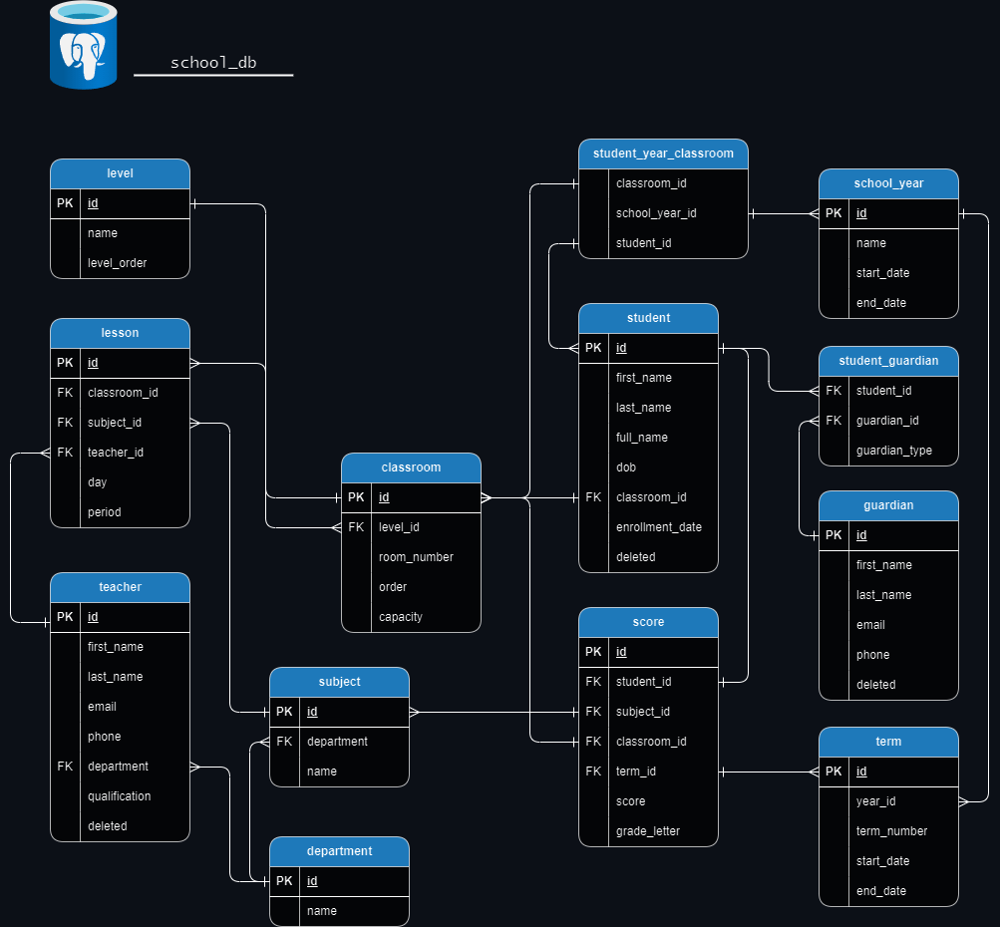

# Jahra'a High School Admin

Jahra'a High School Admin is a school management system designed to streamline administrative tasks and improve the overall efficiency of school operations. Built with Java, Spring Boot, and PostgreSQL, this application offers features such as attendance tracking, weekly schedule generation, student-carer relationship management, and score management.

This application was inspired by my experiences at Aljahra'a Alahlya High School in Kuwait and is designed to meet the needs of similar educational institutions. While it is tailored to my high school, it can be adapted for use in other schools across Kuwait.

## Features

- **Student Management**: Add, update, and delete student records.
- **Teacher Management**: Manage teacher information including departments and qualifications.
- **Classroom Management**: Organize classrooms by level and capacity.
- **Guardian Management**: Associate guardians with students for better communication.
- **Schedule Generation**: generate weekly lesson schedules for teachers and classrooms.
- **Score Management**: Record and track student scores and grades.
- - **Attendance Tracking**: Automated attendance records with CRON job scheduling.

## Database Schema

